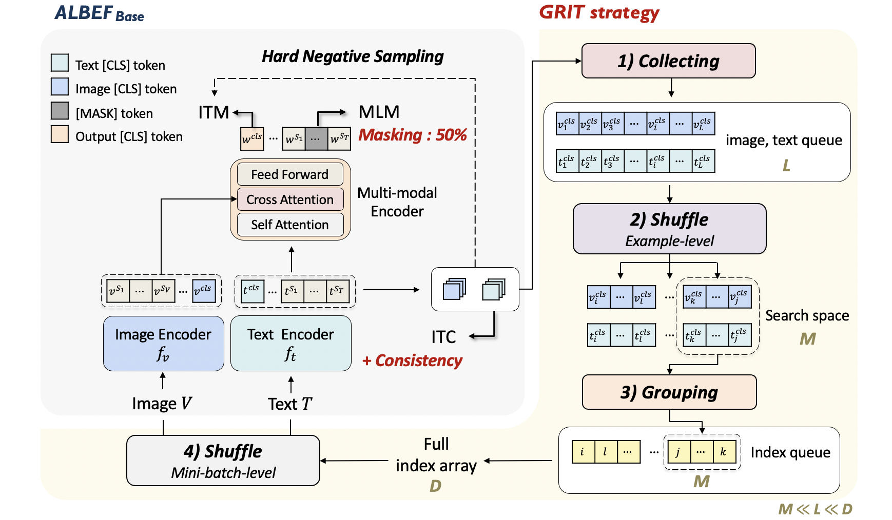

## GRIT-VLP: GRouped mIni-baTch sampling for Efficient Vision-Language Pre-training
This is the official PyTorch implementation of "GRIT-VLP: GRouped mIni-baTch sampling for Efficient Vision-Language Pre-training"
(Accepted to ECCV 2022)

You can find the implementation codes for pre-training and fine-tuning GRIT-VLP. 

### Pre-training Dataset Download:
- [MSCOCO (2014)](https://cocodataset.org/#download)
- [Visual Genome (VG)](https://visualgenome.org/api/v0/api_home.html)
- [Conceptual Captions](https://www.kaggle.com/ad271828/conceptual-captions-dataset-train-and-validation)
- [SBU Captions](http://www.cs.virginia.edu/~vicente/sbucaptions/)

### Downstream-task Datasets:
- [NLVR2](https://github.com/lil-lab/nlvr/tree/master/nlvr2#direct-image-download)
- [Flickr30k](https://www.kaggle.com/hsankesara/flickr-image-dataset)
- [VQA v2](https://visualqa.org/download.html)

### Json Files:
- Use same json files from [ALBEF](https://github.com/salesforce/ALBEF)
- Change the image path in json files according to your downloaded images (In CC3M and SBU, some images can not be crawled, thus, you should consider about these missing images when creating json files)

### Requirements:
* pytorch 1.8.0
* transformers 4.8.1
* timm 0.4.9

### Pre-training:
1. Pre-train the model using 4 A100 GPUs:
<pre>python3 -m torch.distributed.launch --nproc_per_node=4 --use_env Pretrain.py --config ./configs/Pretrain.yaml --output_dir output/Pretrain/  </pre> 

### Downstream tasks:
1. IRTR (MS-COCO) using 4 A100 GPUs:
<pre>python3 -m torch.distributed.launch --nproc_per_node=4 --use_env Retrieval.py --config ./configs/Retrieval_coco.yaml --output_dir output/Retrieval_coco/  --checkpoint [Pretrained checkpoint] </pre> 

2. IRTR (Flickr) using 4 A100 GPUs:
<pre>python3 -m torch.distributed.launch --nproc_per_node=4 --use_env Retrieval.py --config ./configs/Retrieval_flickr.yaml --output_dir output/Retrieval_coco/  --checkpoint [Pretrained checkpoint] </pre> 

3. NLVR using 4 A100 GPUs:
<pre>python3 -m torch.distributed.launch --nproc_per_node=4 --use_env Pretrain_nlvr.py --config ./configs/NLVR_pretrain.yaml --output_dir output/NLVR_pretrain/ --checkpoint [Pretrained checkpoint] 
python3 -m torch.distributed.launch --nproc_per_node=4 --use_env NLVR.py --config ./configs/NLVR.yaml --output_dir output/NLVR/ --checkpoint [NLVR-Pretrained checkpoint] 
</pre>  

4. VQA using 4 A100 GPUs:
<pre>python3 -m torch.distributed.launch --nproc_per_node=4 --use_env VQA.py --config ./configs/VQA.yaml --output_dir output/vqa/ --checkpoint [Pretrained checkpoint] </pre> 

#### If you have any questions or problems to run this code, please mail to wotjr3868@snu.ac.kr or gxq9106@gmail.com. Thank you!

### Acknowledgement:
Our code implementation is largely borrowed from [ALBEF](https://github.com/salesforce/ALBEF#download) since our method is mainly built upon it. We appreciate the original authors for sharing code.

